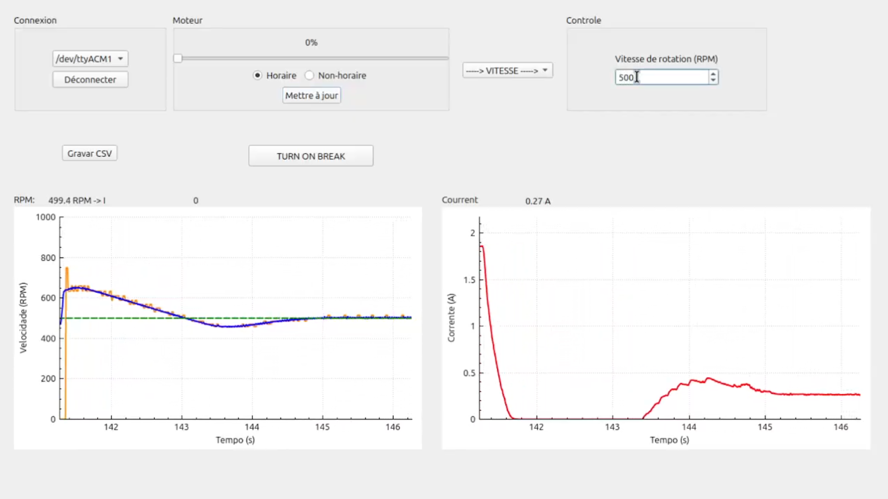

# 🖥️ HMI Desktop Dashboard (Qt/C++)

This directory contains the Human-Machine Interface (IHM / HMI) developed for the DC Motor Control project. Built with **Qt C++**, this application serves as the telemetry dashboard and control center, communicating asynchronously with the STM32 microcontroller via Serial Port (UART) at 115200 bauds.

> **Note:** This repository hosts the graphical interface. The hard real-time control firmware (C) running on the STM32 microcontroller is hosted in a separate repository: [ips_mcc_stm32](https://github.com/Lucas-P-Souza/ips_mcc_stm32).

## ✨ Key Features

* **Real-Time Data Visualization:** Utilizes the `QCustomPlot` library to render high-performance, live-updating charts for Motor Speed (RPM) and Electrical Current, synchronized with the microcontroller's 100 Hz sampling rate.
* **Smart Data Export (CSV):** Features a dedicated timeline separation system. When data logging is initiated, the time and revolution counters are perfectly zeroed (`t=0.00s` and `voltas=0`), generating clean `.csv` files ready for MATLAB or Excel analysis without requiring manual offset adjustments.
* **Actuation Panel:**
  * **PWM Slider (Open-Loop):** Send precise open-loop power targets (0-100%) directly to the hardware *Hacheur*.
  * **RPM Target (Closed-Loop):** Send speed references for the STM32's internal PI controller to track.
  * **Direction Control:** Toggle motor rotation (CW/CCW).
  * **Emergency Stop (Brake):** Sends an immediate hardware-priority command to trigger the physical brake system safely.
* **Robust Serial Parsing:** Handles continuous UART data streams safely, utilizing hardware interrupts on the STM32 side and non-blocking event loops on the Qt side, preventing UI freezes and ensuring data integrity.

## 🖼️ Interface Overview

  

## 🧰 Dependencies

To compile and run this interface, you will need:
* **Qt Creator** (Compatible with Qt 5 / Qt 6)
* **Qt SerialPort Module** (Ensure `QT += serialport` is present in your `.pro` file)
* **QCustomPlot** (The source files `qcustomplot.h` and `qcustomplot.cpp` are already included in the project directory).

---
*Développé dans le cadre du module d'Interface Puissance Système.*
**Professeur:** M. Bourgeot
